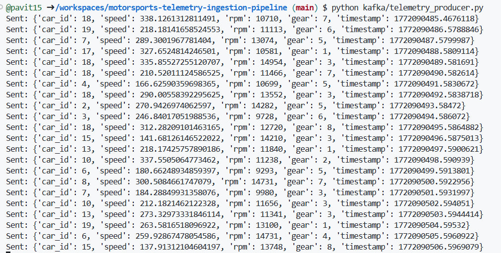

# Motorsports Telemetry Ingestion Pipeline🏎️🏎️

This project implements a real-time data ingestion pipeline using Apache Kafka and Apache Flink, writing processed telemetry data into MinIO (S3-compatible object storage).

It simulates live motorsports telemetry (speed, RPM, gear, timestamp), processes streaming data using Flink, and persists structured output into an object storage bucket, following a modern stream-to-data-lake architecture pattern.

## Project architecture overview

Producer (Host) -> Kafka (telemetry_data topic) -> Apache Flink (Stream Processing + Windowing) -> MinIO (S3-compatible Object Storage)

## Tech stack used
Component	| Role
---|---
Kafka	|Real-time event ingestion
Flink (PyFlink)	|Stream processing & windowed aggregation
MinIO	|Object storage (S3-compatible data lake)
Docker Compose|	Container orchestration
Python|	Telemetry producer

## How To Run
1. Start the project
```
docker compose down -v
docker compose up --build -d
```
Verify services:
```
docker compose ps
```
You should see:

zookeeper

kafka

minio

minio-init

flink-jobmanager

flink-taskmanager


2️/ Verify MinIO

Open MinIO Console:

http://localhost:9001

Credentials:
```
Username: minioadmin
Password: minioadmin
```
_telemetry-data_ bucket is created automatically via minio-init


3. Create Kafka Topic
```
docker compose exec kafka kafka-topics --create \
--topic telemetry_data \
--bootstrap-server kafka:29092 \
--replication-factor 1 \
--partitions 1
```
Verify:
```
docker compose exec kafka kafka-topics \
--bootstrap-server kafka:29092 --list
```
4. Submit Flink Job
```
docker compose exec flink-jobmanager \
flink run -d -py /opt/flink/jobs/telemetry_job.py
```
Open Flink UI:

http://localhost:8081

Ensure job is RUNNING.


5️. Run the data producer 
```
python kafka/telemetry_producer.py
```
You should see:

Sent: { ... }


6️. Verify Data in MinIO

Navigate to:

telemetry-data / telemetry / YYYY-MM-DD-HH

You will see:

telemetry-0-0.json
telemetry-0-1.json
_telemetry-..._tmp_...

⚠ _tmp_ files are in-progress files and are finalized on checkpoint.


# Streaming Logic
#### 1. Sample Telemetry Event (Kafka topic: telemetry_data)

Each event represents live motorsports telemetry emitted by a vehicle:
```
{
  "car_id": 7,
  "speed": 312.4,
  "rpm": 13450,
  "gear": 6,
  "timestamp": 1708932712.52
}
```

#### 2. Field Description

Field	| Type	| Description
---|---|---
car_id	| Integer	| Unique identifier of the vehicle
speed|	Float	|Current vehicle speed (km/h)
rpm|	Integer|	Engine revolutions per minute
gear|	Integer|	Current transmission gear
timestamp|	Float	|Event generation time 

#### 3. Stream processing workflow

**Keyed Stream Partitioning**

The stream is partitioned by _car_id_, ensuring all events for a given vehicle are processed by the same parallel task.

This enables stateful processing and consistent window aggregation per vehicle.

**Real-Time Stream Ingestion**

Continuous ingestion from Kafka topic telemetry_data

Event-driven processing model

Exactly-once semantics through checkpointing

**Window-Based Aggregation**

The job applies tumbling time window, where within each window, Flink computes average speed and average RPM

This enables near real-time performance analytics per vehicle.

**Data Lake Sink (MinIO  S3 Compatible)**

Processed results are written to:
```
s3://telemetry-data/telemetry/YYYY-MM-DD-HH/
```
Output format:
```
{
  "car_id": 7,
  "avg_speed": 305.8,
  "avg_rpm": 13210,
  "window_start": 1708932705,
  "window_end": 1708932710
}
```

**Storage Characteristics**

- S3-compatible object storage (MinIO)

- Partitioned directory structure

- Checkpoint-aware file finalization

- JSON output (can be upgraded to Parquet)

## Configuration highlights

Flink S3 Configuration (flink-conf.yaml)

s3.endpoint: http://minio:9000

s3.path.style.access: true

s3.access-key: minioadmin

s3.secret-key: minioadmin

s3.connection.ssl.enabled: false

## Ports used
Service	| Port
---|---
Kafka |	29092
Zookeeper |	2181
Flink UI |	8081
MinIO API	| 9000
MinIO Console	| 9001

## Future scope

- Write output in Parquet instead of JSON

- Add checkpoint state backend to MinIO

- Partition data by year/month/day/hour

- Add schema registry integration

- Deploy to Kubernetes
